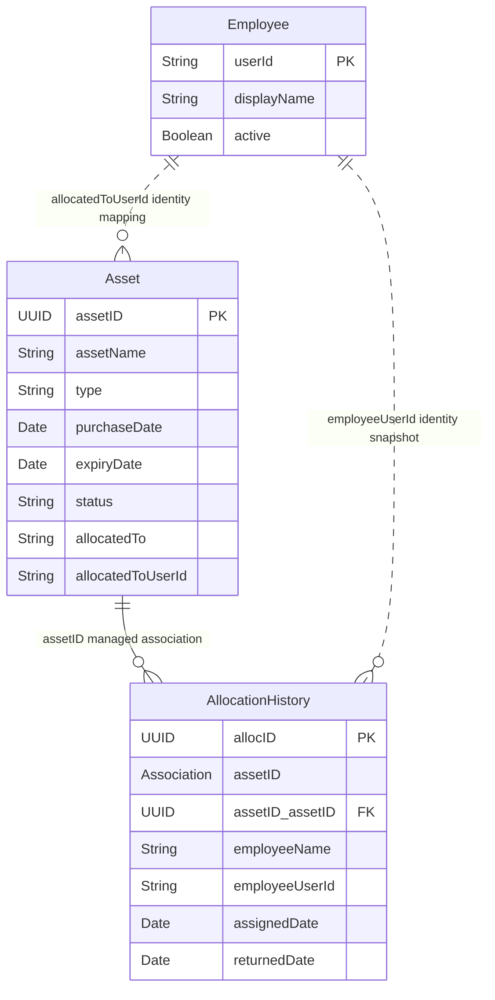

# Assumptions and Data Model Design

## Purpose and status

This document describes the implemented IT Asset Lifecycle Management model and the business assumptions used by its CAP handlers. These decisions resolve assessment ambiguities; they are not additional assessment instructions. Local implementation/evidence and unverified deployed behavior are distinguished explicitly.

## Architecture and runtime assumptions

- Backend: SAP CAP with the Node.js runtime.
- Local development: CAP with persistent SQLite storage.
- SAP BTP Cloud Foundry target: CAP with SAP HANA Cloud for persistence and XSUAA for authentication/role scopes.
- SAPUI5 is the browser client and calls the CAP OData service. Business rules and authorization stay in CAP.
- Local mock authentication is for reproducible development only. Cloud deployment must validate the authenticated XSUAA identity and assigned scopes.
- Local and deployed results are reported separately. Configuration source is not proof of a successful cloud runtime or role assignment.

## Required entities and attributes

Names and meanings in this table are preserved from the assessment.

### Asset

| Attribute | Required type | Meaning preserved |
|---|---|---|
| assetID | UUID, primary key | Unique identifier for each asset. |
| assetName | String | Asset name or description. |
| type | String | Asset type, supported values Hardware or Software. |
| purchaseDate | Date | Date the asset was purchased. |
| expiryDate | Date | Software license expiry or hardware warranty end date. |
| status | String | Current asset lifecycle status. |
| allocatedTo | String | Assigned person or department display name/identifier; populated from trusted employee mapping for person assignments. |

### Allocation History

| Attribute | Required type | Meaning preserved |
|---|---|---|
| allocID | UUID, primary key | Unique identifier for each allocation record. |
| assetID | Association to Asset | The asset allocated; this must be a real managed CDS association to Asset. |
| employeeName | String | Employee display name at the time of assignment. |
| assignedDate | Date | Date the asset was assigned. |
| returnedDate | Date, nullable | Return date; null while the record is the active assignment. |

The CDS source preserves the literal required `AllocationHistory.assetID` attribute as a managed association to `Asset`. Its target key is `Asset.assetID`; CAP generates the foreign-key property `assetID_assetID` in persistence and exposed service metadata. The association is not a manually synchronized string. Historical logs may refer to the previous `asset` association and `asset_assetID` column; those records describe the earlier source snapshot.

### Relationship diagram

Each history record references one Asset; an Asset has zero or many historical assignments. `assetID_assetID` is generated from the association, not an additional business attribute. Dotted Employee relationships show logical identity string mappings validated by handlers; they are not additional CDS associations or foreign-key constraints.

## Justified supporting fields and entity

These additions exist only to make identity, audit, lifecycle, and compliance reliable.

| Addition | Implemented purpose |
|---|---|
| Asset.allocatedToUserId | Stores the authenticated employee identity associated with the current assignment. It is cleared on return. It is the authorization key; allocatedTo remains the required human-readable string. |
| AllocationHistory.employeeUserId | Immutable recipient identity snapshot for audit and matching the active history to the asset during return. History is readable only by IT Admin; there is no employee-history endpoint. |
| Employee.userId and Employee.displayName | Maps the canonical authenticated user identity to an enabled employee and the required display name. userId is unique. A small Employee mapping entity prevents authorization based on names. |
| Asset and AllocationHistory.createdAt, createdBy, modifiedAt, modifiedBy | CAP managed audit fields for inventory and allocation changes. Lifecycle handlers explicitly record the actor when updating persistence entities. |
| Employee.createdAt, createdBy, modifiedAt, modifiedBy | Managed audit fields for the controlled administrator provisioning action. Public directory reads return only userId, displayName, active. |
| Asset.retiredAt and Asset.retirementReason | Explain and timestamp a terminal retirement/disposal while keeping the required status string. |
| Asset.maintenanceReason | Records the reason for moving an unassigned asset into maintenance; cleared when maintenance is completed or the asset is retired. |
| Employee.active | Lets IT Admins allocate only to an enabled identity mapping without deleting former employees from history. |

No persisted compliance flag or asset status is required for alerts: the `complianceAlerts()` function calculates labels from type, expiryDate, allocation history, and configured thresholds on each read, so renewal changes the result immediately. Alert labels include Expired License, License Expiring Soon, Warranty Expired, Warranty Expiring Soon, Missing License Expiry, Missing Hardware Warranty, and Idle Asset; they are not lifecycle statuses.

## Types, lifecycle status, and transitions

Supported type values are Hardware and Software. Hardware expiryDate describes warranty coverage only. Software expiryDate describes license validity only.

The lifecycle vocabulary is Available, Allocated, In Maintenance, and Retired.

- The assessment's example Active is replaced by the more specific Available (ready and unassigned) and Allocated (currently assigned) states. There is no separate Active state.
- Retired represents a disposed asset and is terminal. It is never treated as available.
- Allocation status and compliance status are separate. An expired license may remain Allocated; the warning never clears or changes the assignment.
- New purchased assets enter Available when required purchase data is valid.
- Available to Allocated is allowed only through the allocation action.
- Allocated to Available is allowed only through the return action, which closes the active history row.
- Available to In Maintenance is allowed through a controlled IT Admin action. In Maintenance to Available is allowed after service completion.
- Available or In Maintenance may transition to Retired through a controlled IT Admin disposal action.
- An Allocated asset must first be returned using the normal return workflow; retirement is rejected while an active allocation exists.
- Retired assets cannot be allocated, renewed, or returned as though currently active.
- Direct status edits and unrestricted history create/update/delete are disallowed.

An IT Admin may edit `assetName` through guarded generic PATCH. Identity, type, purchaseDate, status, allocatedTo, and expiryDate are not generic editable fields. Type is fixed at registration; software renewal uses its dedicated operation. No hardware warranty correction/extension operation is currently exposed. Expiry alerts are advisory: the allocation handler does not reject an otherwise eligible asset solely because a Software expiry is in the past. It retains the separate compliance alert and assignment state.

## Date rules and compliance calculations

The default business timezone is `Asia/Kolkata`, configurable through `ASSET_TIME_ZONE`. Date attributes are date-only values. Backend `businessToday()` is returned through session/compliance data for UI labels. `ASSET_FIXED_TODAY` provides the controlled business date used by tests/demonstrations; normal operation leaves it unset.

- purchaseDate cannot be later than businessToday. assignedDate is the business date of allocation. returnedDate is the business date of return and cannot precede assignedDate.
- Software requires expiryDate at registration and renewal. Renewal expiry must be strictly later than both businessToday and the current expiryDate (when present), so renewal extends rather than shortens coverage.
- Hardware expiryDate is optional when warranty information is unavailable. If supplied, it cannot precede purchaseDate.
- expiryDate equal to businessToday remains valid through today. A license is expired only when expiryDate is earlier than businessToday.
- A software license is expiring soon when it is not expired and its expiryDate is from businessToday through businessToday plus 30 calendar days, inclusive. The 30-day window is configurable.
- An expired hardware warranty is labeled Warranty Expired, not Expired License. The same 30-day inclusive window may produce Warranty Expiring Soon.
- A missing software expiry on imported legacy data returns `Missing License Expiry`; it is not counted as expired or expiring. New software registrations cannot omit it. Missing hardware warranty dates return `Missing Hardware Warranty`, not a license alert. Retired assets are excluded from all compliance groups.
- Automated date tests use a controlled reference date and cover expiry yesterday, today, today plus 30, and today plus 31.

## Idle asset rule

The idle period is configurable and defaults to 30 calendar days. An asset is idle only when its lifecycle status is Available and more than 30 full calendar days have elapsed since its baseline. The baseline is the latest valid returnedDate in its history, falling back to purchaseDate if no returned record exists. Exactly 30 days is not idle; day 31 is. Allocated, In Maintenance, and Retired assets are excluded. Registration requires valid purchaseDate, so valid application records have a baseline. If imported/corrupted data has neither a valid return nor purchase date, the current handler omits it from idle results; it does not expose a separate missing-idle-baseline alert.

## Identity mapping and least-privilege roles

The security identity is the immutable canonical subject supplied by the authenticated CAP principal (for example, the XSUAA user identity), not a person's display name or the request's allocatedTo/employeeName value. The Employee mapping resolves that subject to an enabled employee record.

| Role | Read access | Write/actions |
|---|---|---|
| Employee | Only currently assigned asset details, filtered server-side by the authenticated userId. Allocation history is reserved for IT Admin because the assessment only requires employees to view their assigned assets. | No inventory or history writes. |
| IT Admin | Full inventory, history, and trusted employee directory needed to operate the lifecycle. | Register/purchase; edit assetName; allocate; return; renew software; maintain/release; retire/dispose; guarded physical delete; provision a verified employee mapping through the controlled action. |
| Compliance Manager | Read-only compliance and idle projections containing asset identity, type, lifecycle status, expiry, compliance label, and idle baseline as needed. The projection omits employee user IDs and does not expose full assignment history. | No inventory, allocation, renewal, or retirement writes. |

CAP authorization applies to entity reads, actions, and direct OData requests. UI visibility is only a usability feature. Employees allows Admin reads but denies generic writes. The ITAdmin-only `provisionEmployee(userId, displayName)` action creates a new active mapping after the Admin verifies the recipient's actual authenticated `sessionInfo().userId`. It trims surrounding whitespace, preserves case, rejects blank/control-character/overlength and duplicate values, and records actor/time. Existing mappings cannot be overwritten. Provisioning grants neither BTP role collections nor identity-provider credentials. Production role assignment and mapping verification are separate prerequisites; local mock-user seed does not provision production users.

## Transaction, concurrency, and safe deletion assumptions

Allocation validates the asset and enabled employee inside one request transaction, then performs a database-atomic conditional update requiring the row to remain Available with both assignment fields null. Exactly one affected row is required; zero is a conflict. The transaction then inserts the active history and trusted display/identity data together. Local SQLite serialization/conditional update is tested. No partial database uniqueness constraint for active histories is declared; integrity relies on the controlled service operations and conditional row transition. HANA must be verified with concurrent requests after deployment; local success does not prove the deployed adapter behavior.

Return conditionally transitions the Allocated row and closes exactly its active history record in the same request transaction. It verifies employee identity and display snapshots match the current assignment and the return business date does not precede assignedDate. Missing, duplicate, mismatched, or repeated returns are rejected before partial state can commit. The repaired suite verifies state/audit/history remain unchanged for inconsistent fixtures.

No allocation history row is overwritten. History with allocation records is immutable except for the one-time return closure by the return action. Assets that have any history are never physically deleted; they are retired. A physical delete may be allowed only for an IT Admin and an asset with no history, using a guarded delete operation that checks the history relation transactionally. If the database/adapter cannot enforce the guard safely, disable physical delete entirely and use retirement.

## Implemented CAP service contract

The compiled service is AssetManagementService at /odata/v4/asset-management/. Its exposed entities are Assets, AllocationHistories, Employees, and employee-scoped MyAssets. IT Admins can read allocation history and employee mappings. Employees can read only MyAssets; the handler applies the authenticated principal filter server-side. Compliance Managers and IT Admins call the complianceAlerts() function; any authenticated user can call sessionInfo() for their own principal/role context.

Lifecycle operations match `srv/asset-management-service.cds`: allocateAsset, returnAsset, renewSoftwareLicense, placeInMaintenance, releaseFromMaintenance, and retireAsset. Registration is POST Assets; permitted generic update is PATCH Assets for assetName only. DELETE Assets physically deletes only an unassigned Available asset with no allocation history. History is read-only to clients; allocate/return create and close rows. There is no registerAsset, updateAssetDetails, setHardwareWarranty, or deleteUnallocatedAsset action.

The supporting `provisionEmployee` action returns the public Employee shape and exists solely for reliable audited assignment identity mapping. It does not add an unrestricted employee directory CRUD surface.

Generic API mutations are restricted so lifecycle state and history cannot bypass action handlers. Implemented actions return validation, authorization, not-found, conflict, or server errors without partial database writes.
## Local and Cloud Foundry differences

The current package configuration uses file-backed SQLite (db.sqlite) and mock users in development/test. Its production profile selects SAP HANA through @cap-js/hana and XSUAA authentication. The MTA declares a dedicated-tenant XSUAA application service, HANA HDI container, and standalone approuter. Local configuration is evidenced; Cloud Foundry deployment, role assignment, and production identity onboarding remain unverified.

Use Node 24.x for the complete reproducible build: it satisfies the root runtime and current generated HDI deployer. `npm run db:deploy` runs the SQLite-only history-association migration and then `cds deploy --with-auto-schema-evolution`. The helper backs up an existing database under ignored `db-backups/` before a necessary rename/baseline change; it leaves business rows intact and rejects ambiguous schemas. The migration's idempotence/data preservation is tested with disposable fixtures. It is not a HANA migration utility.

Demo seeding is development/test-only and runs once against an empty inventory. Dates use the business date at seed time and are preserved across later starts. Use a disclosed controlled date or a fresh preserved development inventory to repeat threshold demonstrations.

