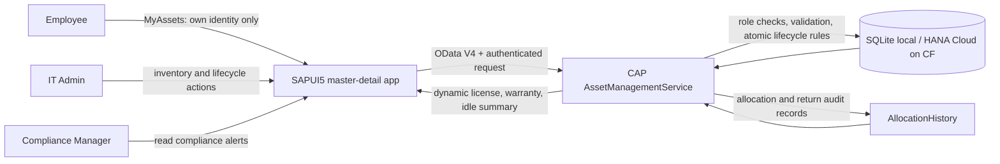

# Project Overview — IT Asset Lifecycle Management

## Objective and business problem

Technology organizations need a reliable inventory of laptops, monitors, and software licenses. This application records purchases, employee assignments, returns, license renewals, maintenance, and disposal. It gives IT staff a traceable allocation history and gives Compliance Managers current expiry and idle-asset alerts.

## Scope and roles

| Role | Capability |
|---|---|
| Employee | Read their currently assigned assets through a server-filtered `MyAssets` endpoint. |
| IT Admin | Register assets; search, filter, and edit allowed descriptive data; allocate, return, renew software, place/release from maintenance, retire/dispose, and view history. |
| Compliance Manager | Read software license expiry, hardware warranty, missing-date, and available-idle alerts. No inventory lifecycle writes or employee identity keys. |

CAP enforces roles and employee identity on API requests. Interface visibility is only a usability feature. Local mocked users are development-only; Cloud Foundry uses XSUAA scopes. The app does not expose a general employee administration screen.

## Architecture

- **Backend:** SAP CAP for Node.js, CDS model, OData V4 service, and lifecycle handlers.
- **Persistence:** File-backed SQLite during local development; SAP HANA Cloud/HDI for the Cloud Foundry production profile.
- **Frontend:** SAPUI5 `sap.m` master-detail application served from CAP's static `app/` directory and connected to the real OData service.
- **Identity:** CAP principal `req.user.id` is mapped to `Employee.userId`. Employee display names never authorize access.
- **Compliance:** CAP calculates date alerts from the configured business clock and returns them separately from lifecycle status.

## High-level flow

## Lifecycle summary

Assets use `Available`, `Allocated`, `In Maintenance`, and `Retired`. `Active` is represented by the more precise `Available` state for ready, unassigned assets; currently assigned assets are `Allocated`. Retirement is terminal and is not availability. Allocation and return update the asset and exactly one allocation history row in a single transaction. Allocation uses a compare-and-set update so concurrent requests cannot both win. An asset with history is retired instead of physically deleted.

Expiry status does not replace lifecycle status. A software license expiring today remains valid through that date; it becomes expired the following day. Expiry warnings include today through the configured 30-day window. Hardware warranty alerts are labeled separately. An available asset becomes idle only after more than 30 full calendar days since its most recent return, or its purchase date if it has never been allocated. Both thresholds and the `Asia/Kolkata` business timezone are configurable.

## Implementation assumptions

These choices resolve assessment ambiguities and are not additional assessment text:

1. The lifecycle vocabulary above replaces a generic `Active` status. Disposal requires no active assignment; an allocated asset must be returned first.
2. New software registrations require a license expiry; imported legacy software with no date is surfaced as a data-quality alert. Hardware expiry means warranty only and may be missing.
3. A single configured business date is used by backend calculations, UI labels, and deterministic date tests. Expiry on today is valid; the 30-day warning boundary is inclusive.
4. Idle means `Available` for more than 30 calendar days from the latest return or, for never-allocated assets, purchase. Allocated, maintenance, and retired assets are excluded.
5. Employee access is based on the authenticated immutable subject and a server-side identity map. Names and department strings are display data only.
6. Local SQLite and mock identities support development and demos. Cloud deployment is configured for HANA Cloud and XSUAA, subject to the actual BTP target's service availability and role setup.

## Delivery and evidence

The delivery plan uses three sprints across the five-day assessment window and explicitly maps all four assessment phases; see [Agile Sprint Plan](agile-sprint-plan.md). Pass/fail/readiness statements are limited to checks with recorded evidence in the [requirement-to-evidence matrix](requirement-evidence-matrix.csv) and [execution evidence index](execution-evidence.md).
